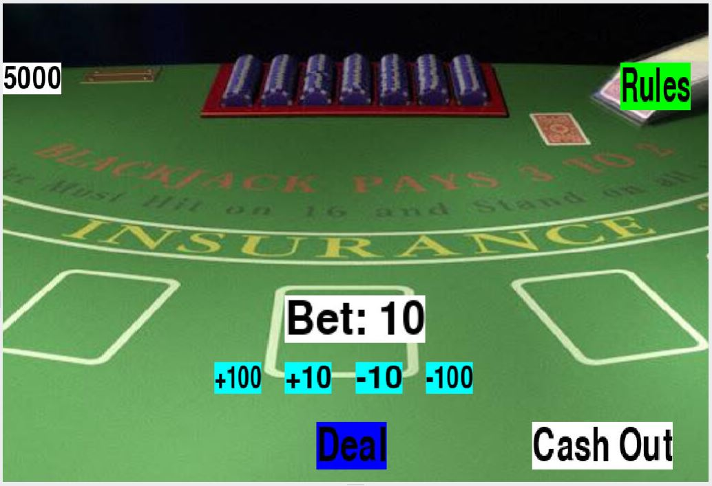
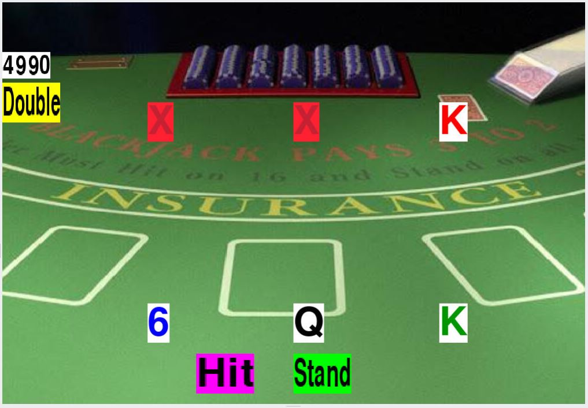
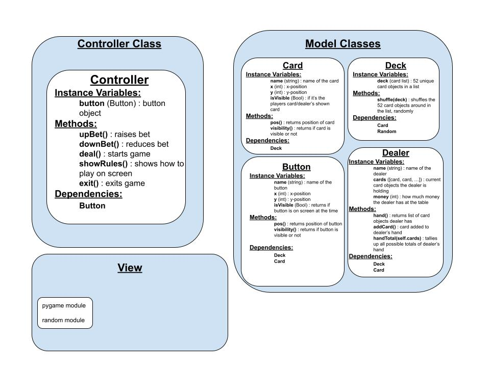

:warning: Everything between << >> needs to be replaced (remove << >> after replacing)
# CS110 Project Proposal
# Jack-Black-Jack
## CS 110 Final Project
### Spring, 2022
### [Assignment Description](https://docs.google.com/document/d/1H4R6yLL7som1lglyXWZ04RvTp_RvRFCCBn6sqv-82ps/edit#)

<< [repl](#) >>

<< [link to demo presentation slides](#) >>

### Team: Python Pirates
#### John Depetro, Maya Anand, Michael Ott

***

## Project Description *(Software Lead)*

  Variation on the classic card game, Black-Jack. In the game we made, you play against the dealer in attempts to get cards that total as close to 31 as you can get without going over. All the same rules as original Black-Jack except there is no 'splitting' option. There is also the added option of, after doubling down, you can quad-up and oct-up to 4x or 8x your original bet. The dealer automatically stops adding cards whenever their cards total at least 27.

***    

## User Interface Design *(Front End Specialist)*

* << A wireframe or drawing of the user interface concept along with a short description of the interface. You should have one for each screen in your program. >>
    * For example, if your program has a start screen, game screen, and game over screen, you should include a wireframe / screenshot / drawing of each one and a short description of the components
* Start Screen

* Playing Screen

* << You should also have a screenshot of each screen for your final GUI >>

***        

## Program Design *(Backend Specialist)*

* Non-Standard libraries
    * pygame module
        * https://www.pygame.org/docs/
        * creates screen and al sprites on the screen, giving users an interface other than the console to play our game
    * random module
        * https://docs.python.org/3/library/random.html
        * a short description of the module
* Class Interface Design

* Classes
    * Card
      * model class for creating a card with a valkue and suit, along with a pygame surface of the oject
    * Deck
      * Contains a list of 104 card objects (2 full decks of playing cards) to be helpful when implementing the controller
    * Player
      * Contains the card objects in the user's hand. Contains functions to add cards to the hand
    * Dealer
      * Subclass of player that keeps track of the dealer's hand
    * Background
      * Loads the background image for the program
    * Button
      * Assists the creation of all clickable button sprites for the program
    * Rules
      * Loads the picture of the rules for the game

## Project Structure *(Software Lead)*

The Project is broken down into the following file structure:

* main.py
* src
    * background.py
    * button.py
    * card.py
    * controller.py
    * dealer.py
    * deck.py
    * player.py
    * rules.py
* assets
    * background.png
    * class_diagram.jpg
    * JBJ_Playing.jpg
    * JBJ_ProgramDesign.jpg
    * JBJ_StartScreen.jpg
    * rules.png
* etc
  

***

## Tasks and Responsibilities *(Software Lead)*

   * You must outline the team member roles and who was responsible for each class/method, both individual and collaborative.

### Software Lead - John 

<< Worked as integration specialist by... >>

### Front End Specialist - Michael

<< Front-end lead conducted significant research on... >>

### Back End Specialist - Maya

<< The back end specialist... >>

## Testing *(Software Lead)*

* << Describe your testing strategy for your project. >>
    * << Example >>

## ATP

| Step                  | Procedure     | Expected Results  | Actual Results |
| :----------------------:|:-------------| :-----------------| -------------- |
|  1  | Click 'Run' button  | GUI window appears in menu screen  |         |
|  2  | Click 'Rules' button  | Rules of Jack-Black-Jack are displayed (Click rules again to go back to menu) |                 |
|  3A  | Click '+100' button | Bet will go up by 100|                 |
|  3B  | Click '+10' button  | Bet will go up by 10|                 |
|  3C  | Click '-10' button  | Bet will go down by 10 (Unless bet were to go below the minimum bet of 10. Bet will only go as low as 10)|                 |
|  3D  | Click '-100' button  | Bet will go down by 100 (Unless bet were to go below the minimum bet of 10. Bet will only go as low as 10)|                |
|  4  | Click 'Deal' button  | 3 cards added to player's and dealer's hand. 2 of dealer's cards are hidden |                 |
|  5A  | Click 'Hit' button  | Adds additional card to players hand, disables 'Double' option |                  |
|  5B  | Click 'Double' button  | Doubles the original bet of the current hand, displays 'Quad-Up' button, adds card to player's hand, disables 'Hit' option |                  |
|  6  | Click 'Quad-Up' button  | Multiplies the original bet of the current hand by 4, displays 'Oct-Up' button, adds card to player's hand  |                  |
|  7  | Click 'Oct-Up' button  | Multiplies the original bet of the current hand by 8, adds card to player's hand  |                  |
|  8  | Click 'Stand' button  | Reveals all of dealer's cards and brings game to 'SHOWDOWN' state. Dealer logic works itself out and decides if player Loses, Wins, or Ties. |                  |
|  9  | Wait until returned to Betting screen  | User will be able to play click deal again to start a new hand |                  |
|  10 | Click 'Cashout' button  | Game exits, game window closes, and a text file is created with player's total money from the table in it |                  |